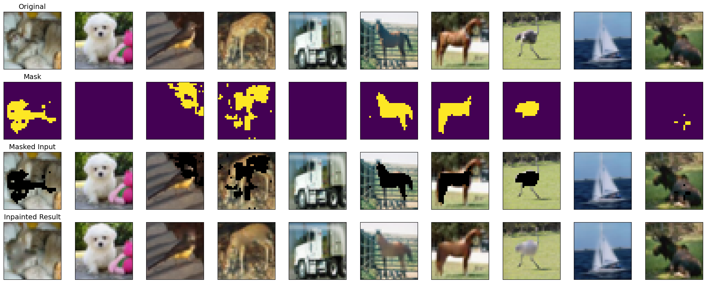
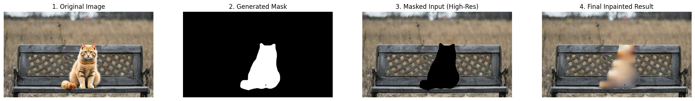
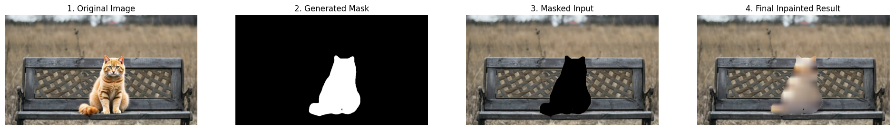

# Advanced Image Inpainting with a Refined U-Net

This repository contains a PyTorch implementation of an advanced image inpainting pipeline. The project trains and evaluates deep learning models to fill in missing parts of images from the CIFAR-10 dataset. The core of this experiment is a **U-Net architecture enhanced with specialized Feature Refinement Modules (FRMs)**, designed to produce sharper and more contextually aware results.

We explore two main architectural improvements:
1.  A U-Net with a simple, convolution-based **Feature Refinement Module (FRM)**.
2.  A U-Net with a more powerful, multi-scale **ASPP-based FRM**.

The entire process, from data preparation to model evaluation, is encapsulated in a single, reproducible Google Colab notebook.

## Table of Contents
- [Project Overview](#project-overview)
- [Key Features](#key-features)
- [Results Showcase](#results-showcase)
  - [CIFAR-10 Test Set Samples](#1-cifar-10-test-set-samples)
  - [High-Resolution Test with a Large Mask](#2-high-resolution-test-with-a-large-mask)
- [Evaluation and Analysis](#evaluation-and-analysis)
  - [Quantitative Metrics](#quantitative-metrics)
  - [Results Comparison](#results-comparison)
- [Model Architecture](#model-architecture)
  - [The U-Net Framework](#the-u-net-framework)
  - [The Feature Refinement Modules](#the-feature-refinement-modules)
- [The Experimental Pipeline](#the-experimental-pipeline)
- [How to Run](#how-to-run)

## Project Overview

Image inpainting is the task of reconstructing missing regions in an image. This project moves beyond simple autoencoders to implement and compare sophisticated U-Net based models. A key challenge in inpainting is maintaining textural and structural consistency. To address this, we integrate two types of **Feature Refinement Modules (FRMs)** into the decoder of our U-Net. These modules intelligently use information from the unmasked (valid) regions of an image to guide the reconstruction of the masked (invalid) regions at multiple feature scales.

The models are trained and evaluated on the CIFAR-10 dataset using object-aware masks generated by a pre-trained `DeepLabV3` segmentation model.

## Key Features

- **Advanced Architectures:** Implements and compares two refined U-Net models: one with a **simple FRM** and one with a more powerful **ASPP-based FRM**.
- **Intelligent Masking:** Uses a pre-trained `DeepLabV3` model to generate realistic, object-based masks, creating a challenging and practical training scenario.
- **Efficient Pipeline:** Employs a pre-computation strategy for masks, making the training loop fast and reproducible.
- **Comprehensive Evaluation:** Measures model performance using a suite of four standard metrics: **PSNR, SSIM, LPIPS, and FID**.
- **End-to-End Script:** The entire experiment is contained in a single, easy-to-run Google Colab notebook.

## Results Showcase

### 1. CIFAR-10 Test Set Samples

Below is a visual comparison of the outputs from both the simple FRM model and the more advanced ASPP-FRM model on the CIFAR-10 test set.

| Model | Inpainting Result |
| :---: | :---: |
| **U-Net with Simple FRM** |  |
| **U-Net with ASPP-FRM** |  |

*(From top to bottom in each image: Original, Mask, Masked Input, and Inpainted Result)*

### 2. High-Resolution Test with a Large Mask

To test the models' ability to handle more challenging scenarios, we performed inference on a high-resolution image with a large, contiguous mask.

| Model | Inpainting Result on High-Resolution Image |
| :---: | :---: |
| **U-Net with Simple FRM** |  |
| **U-Net with ASPP-FRM** |  |

## Evaluation and Analysis

### Quantitative Metrics

The performance of both models was evaluated on the 10,000 images of the CIFAR-10 test set using four complementary metrics. Here is a description of each:

- **PSNR (Peak Signal-to-Noise Ratio):** Measures the pixel-wise difference between the original and reconstructed images. It is a measure of raw reconstruction accuracy. **(Higher is better)**
- **SSIM (Structural Similarity Index):** Compares images based on luminance, contrast, and structure. It is designed to be closer to how humans perceive similarity. **(Higher is better)**
- **LPIPS (Learned Perceptual Image Patch Similarity):** Uses a deep neural network (VGG) to measure the distance between features extracted from the original and reconstructed images. This metric correlates very well with human judgment of perceptual quality. **(Lower is better)**
- **FID (Fréchet Inception Distance):** Measures the statistical similarity between the distribution of real and generated image patches. A low FID indicates that the generated content is both high-quality and diverse, making it a strong measure of realism. **(Lower is better)**

**Metrics closer to human perception:** **LPIPS** and **SSIM** are considered the most aligned with human perception of image quality, as they focus on structural and deep-feature similarity rather than just pixel-level errors. FID is also an excellent perceptual metric, focusing on the realism of the output distribution.

### Results Comparison

| Metric (on CIFAR-10 Test Set) | U-Net with Simple FRM | U-Net with ASPP-FRM | Best |
| :--- | :---: | :---: | :---: |
| **PSNR (dB)** `(Higher is better)` | 31.7797 | **32.1661** | ASPP |
| **SSIM** `(Higher is better)` | 0.8667 | **0.8714** | ASPP |
| **LPIPS** `(Lower is better)` | 0.1195 | **0.1142** | ASPP |
| **FID** `(Lower is better)` | **20.2196** | 21.8554 | Simple |

**Analysis:**

- The **U-Net with the ASPP-FRM outperforms the simple FRM on all metrics that measure direct reconstruction and perceptual quality (PSNR, SSIM, LPIPS)**. The ASPP module's ability to capture multi-scale context allows it to produce a more accurate and visually pleasing result.
- Interestingly, the simple FRM achieves a slightly better FID score. This could indicate that while the ASPP model is better at reconstructing the specific missing content (higher PSNR/SSIM), the simpler model might be producing a slightly more statistically diverse set of textures. However, the strong performance of the ASPP model across the other perceptual metrics suggests it is the superior architecture overall.

## Model Architecture

### The U-Net Framework

The model is built on a U-Net, a powerful encoder-decoder architecture with **skip connections** that prevent the loss of fine-grained details during reconstruction.

### The Feature Refinement Modules

The key innovation is the integration of a **Feature Refinement Module (FRM)** into every stage of the U-Net's decoder. The FRM's purpose is to intelligently "heal" the feature maps during the upsampling process by using information from the unmasked regions to guide the reconstruction of the masked regions.

  <!-- You would need to create and upload this diagram -->

**1. Simple FRM:** Uses a small, local convolutional network to analyze the context immediately surrounding the hole.
**2. ASPP-FRM:** Uses Atrous Spatial Pyramid Pooling (ASPP) to analyze the context at multiple scales simultaneously (local, medium, and global), leading to a more robust understanding of the scene.

## The Experimental Pipeline

The project follows a robust, multi-step pipeline for efficiency and reproducibility:
1.  **Mask Pre-computation:** A `DeepLabV3` model generates 50,000 object-aware masks, which are saved to disk.
2.  **Efficient Data Loading:** A custom PyTorch `Dataset` class loads images and their corresponding pre-computed masks.
3.  **Model Training:** The model is trained for 15 epochs using the Adam optimizer and MSE loss.
4.  **Evaluation:** The trained model is evaluated on the test set using both qualitative visualization and the four quantitative metrics.

## How to Run

This project is designed to be run in a Google Colab environment with a GPU runtime.
1.  **Open the Notebook:** Open the `inpainting_project.ipynb` in Google Colab.
2.  **Select GPU Runtime:** Go to `Runtime` -> `Change runtime type` and select `GPU`.
3.  **Run the Cells:** The notebook is organized into logical steps. Run the cells in order to execute the full pipeline. You can choose which model to train by selecting the appropriate architecture definition.