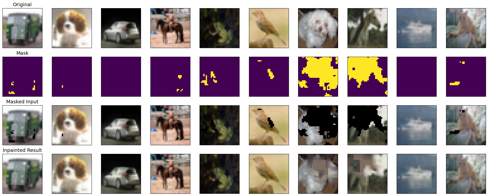

# Advanced Image Inpainting with a Refined U-Net

This repository contains a PyTorch implementation of an advanced image inpainting pipeline. The project trains a deep learning model to fill in missing or corrupted parts of images from the CIFAR-10 dataset. The core of this experiment is a **U-Net architecture enhanced with a Feature Refinement Module (FRM)**, designed to produce sharper and more contextually aware results than a standard autoencoder.

The entire process, from data preparation to model evaluation, is encapsulated in a single Google Colab notebook.

## Table of Contents
- [Project Overview](#project-overview)
- [Key Features](#key-features)
- [Results Showcase](#results-showcase)
- [The Experimental Pipeline](#the-experimental-pipeline)
- [Model Architecture](#model-architecture)
  - [The U-Net Framework](#1-the-u-net-framework)
  - [The Feature Refinement Module (FRM)](#2-the-feature-refinement-module-frm)
- [How to Run](#how-to-run)
- [Evaluation Metrics](#evaluation-metrics)

## Project Overview

Image inpainting is the task of reconstructing missing regions in an image. This project moves beyond simple autoencoders to implement a more sophisticated U-Net based model. A key challenge in inpainting is maintaining textural and structural consistency between the original and inpainted regions. To address this, we include a **Feature Refinement Module (FRM)** into the decoder of our U-Net, inspired by the principles of modern inpainting research. This module intelligently uses information from the unmasked (valid) regions of an image to guide the reconstruction of the masked (invalid) regions at multiple feature scales.

The model is trained and evaluated on the CIFAR-10 dataset using object-aware masks generated by a pre-trained `DeepLabV3` segmentation model.

## Key Features

- **Advanced Architecture:** Implements a U-Net enhanced with a **Feature Refinement Module (FRM)** for improved detail and context awareness.
- **Intelligent Masking:** Uses a pre-trained `DeepLabV3` model to generate realistic, object-based masks, creating a more challenging and practical training scenario.
- **Efficient Pipeline:** Employs a pre-computation strategy for masks, making the training loop fast and efficient.
- **Comprehensive Evaluation:** Measures model performance using a suite of four standard metrics: PSNR, SSIM, LPIPS, and the Fréchet Inception Distance (FID) on inpainted patches.
- **End-to-End Script:** The entire experiment is contained in a single, easy-to-run Google Colab notebook.

## Results Showcase

The model is capable of generating plausible and detailed content to fill missing object regions. Below is a sample of the model's output on the test set.

*(From top to bottom: Original Image, Generated Mask, Masked Input, and the final Inpainted Result)*

## The Experimental Pipeline

The project follows a robust, multi-step pipeline to ensure efficiency and reproducibility:

1.  **Mask Pre-computation:** Before training, we iterate through the entire CIFAR-10 training set. For each image, we use a powerful `DeepLabV3` segmentation model to identify an object and generate a corresponding binary mask. These 50,000 masks are saved to disk. This heavy step is performed only once.

2.  **Efficient Data Loading:** A custom PyTorch `Dataset` class (`InpaintingDataset`) is used. It loads an image and its corresponding pre-computed mask, making the training data pipeline extremely fast.

3.  **Model Training:** The `UNetWithFRM` model is trained for 15 epochs using the Adam optimizer and Mean Squared Error (MSE) loss. The model takes both the masked image and the mask as input to enable the feature refinement process.

4.  **Evaluation:** After training, the model's performance is evaluated on the 10,000 images of the test set. This includes both a qualitative visualization of sample outputs and a quantitative analysis using four different metrics.

## Model Architecture

The core of this project is the `UNetWithFRM` model, which is composed of two main architectural concepts.

### 1. The U-Net Framework

The model is built on a U-Net, a powerful encoder-decoder architecture with **skip connections**.

- **Encoder:** A downsampling path with 4 stages that progressively extracts more abstract, semantic features while reducing spatial dimensions (32x32 -> 4x4).
- **Decoder:** An upsampling path with 4 stages that reconstructs the image.
- **Skip Connections:** These connections pass high-resolution feature maps directly from the encoder to the corresponding decoder stage. This is critical for preventing the loss of fine-grained details, which helps combat the blurriness common in simpler autoencoders.

### 2. The Feature Refinement Module (FRM)

This is the key innovation, integrated into every stage of the U-Net's decoder. The FRM's purpose is to intelligently "heal" the feature maps during the upsampling process.

**How it Works:**

1.  **Receive Fused Features:** The FRM operates on the feature map created by merging the upsampled data and the skip connection data.
2.  **Analyze Valid Regions:** It uses a small convolutional sub-network to analyze the patterns and textures only in the **valid (unmasked)** parts of the feature map.
3.  **Generate Refined Features:** Based on what it learned from the valid regions, it generates a new set of "refined" features.
4.  **Intelligent Fill:** It uses these refined features to **fill in only the masked parts** of the feature map, ensuring the newly generated content is texturally and structurally consistent with its surroundings.

*(A simple diagram illustrating the FRM concept could be added here)*

This process allows the decoder to make highly context-aware decisions at every scale of the reconstruction, leading to superior results.

## How to Run

This project is designed to be run in a Google Colab environment with a GPU runtime.

1.  **Open the Notebook:** Open the `u-net-refined.ipynb` notebook in Google Colab.
2.  **Select GPU Runtime:** In the menu, go to `Runtime` -> `Change runtime type` and select `GPU` as the hardware accelerator.
3.  **Run the Cell:** The entire code is in a single cell. Simply run this cell to execute the full pipeline.

The script will handle all dependencies, perform mask generation, train the model, and output the final visualization and evaluation report. The total runtime is approximately 20-30 minutes.

## Evaluation Metrics

The model's output is evaluated using four complementary metrics to provide a holistic view of its performance:

- **PSNR (Peak Signal-to-Noise Ratio):** Measures pixel-wise reconstruction accuracy. **(Higher is better)**
- **SSIM (Structural Similarity Index):** Measures perceptual similarity based on structure, contrast, and luminance. **(Higher is better)**
- **LPIPS (Learned Perceptual Image Patch Similarity):** Measures perceptual similarity using deep features from a pre-trained VGG network. **(Lower is better)**
- **FID (Fréchet Inception Distance):** Measures the statistical similarity between the distribution of real and generated image patches. **(Lower is better)**